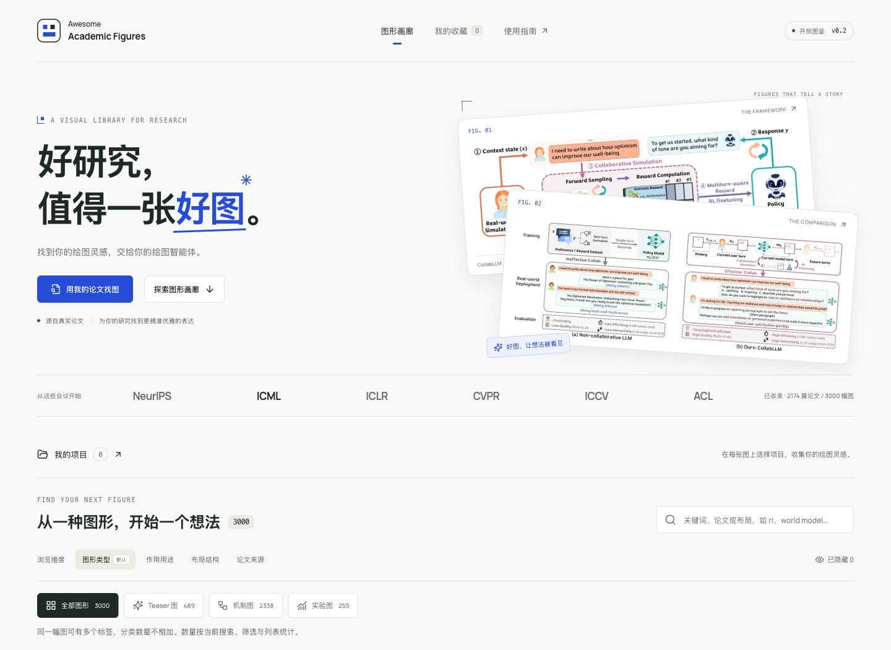
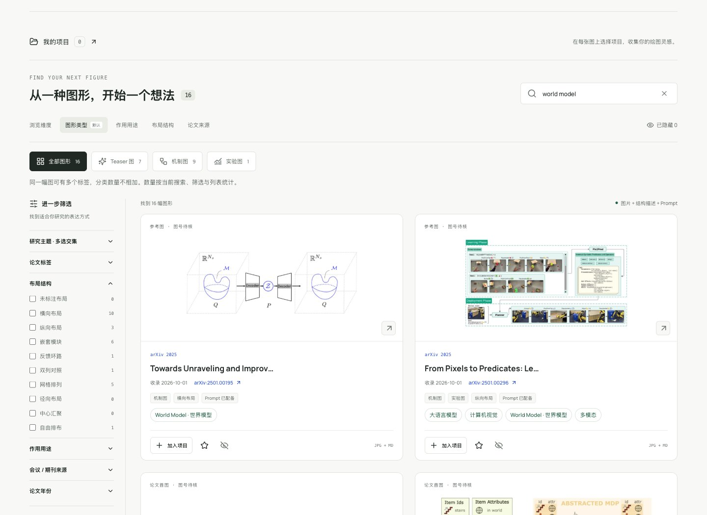
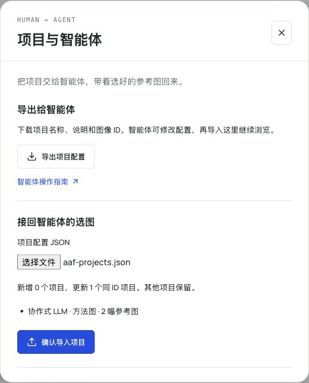

  <h1>Awesome Academic Figures</h1>
  
<strong>找到你的绘图灵感，交给你的绘图智能体。</strong>

  
3,000 幅真实论文图 · 2,174 篇论文 · 会议、期刊与 arXiv

  

    <a href="https://doczbs.github.io/Awesome-Academic-Figures/"><strong>打开画廊 ↗</strong></a> &nbsp; · &nbsp;
    <a href="docs/USAGE.md">我来找图</a> &nbsp; · &nbsp;
    <a href="AGENTS.md">让 Agent 帮我找</a>
  

点击截图，去画廊逛逛。

一张好图，往往能让方法一下子变得清楚。这里收集论文里的 Teaser、机制图、方法框架与实验图，让你先找到喜欢的表达，再为自己的研究找到更精准优雅的表达。

## 先逛一逛，下一张图也许就有灵感

看布局，找结构，打开原图看看作者怎样讲清一个想法。也可以试试 [RL](https://doczbs.github.io/Awesome-Academic-Figures/?q=rl)、[World Model](https://doczbs.github.io/Awesome-Academic-Figures/?q=world+model) 或 [ICL](https://doczbs.github.io/Awesome-Academic-Figures/?q=icl)，沿着自己的研究方向逛。

已经有论文草稿？点 **「用我的论文找图」**，上传 PDF 或粘贴摘要与方法，选择想画的图类，看看有哪些参考建议。

## 喜欢的表达，留在你的项目里

每张图都可以选择加入哪个项目，也可以同时放进多个项目。为一篇论文、一个研究方向建一块参考板，让零散的灵感慢慢长成你的下一张图。

示例项目：协作式 LLM 的方法框架与训练 / 应用对比。

## 然后，交给你的绘图智能体

把参考图、结构描述、prompt 和自己的绘图任务一起带走。也可以先把项目配置交给 Agent，让它检索、挑选和整理，再把选好的图带回画廊。

  

**我的项目 → 项目与智能体**，就是你们交接灵感的地方。项目通过轻量 JSON 文件往返，图片按需读取。智能体的命令与数据入口都放在 [AGENTS.md](AGENTS.md)。

---

**想继续了解？** [使用指南](docs/USAGE.md) · [搜索与标签](docs/SEARCH_AND_TAGS.md) · [给智能体的指南](AGENTS.md) · [本地开发](docs/DEVELOPMENT.md)

截图来自实际在线界面，项目内容为演示配置。项目保存在各自浏览器中；论文匹配在浏览器内按关键词与主题推荐。图号、来源和 prompt 的核验状态随每张图保留，详见[图库说明](docs/COLLECTION.md)。

代码与原创文字采用 [MIT](LICENSE)，论文图像遵循各自[许可](docs/LICENSING.md)。欢迎[贡献新的图与改进](CONTRIBUTING.md)，也欢迎把这个画廊分享给正在画图的人。
