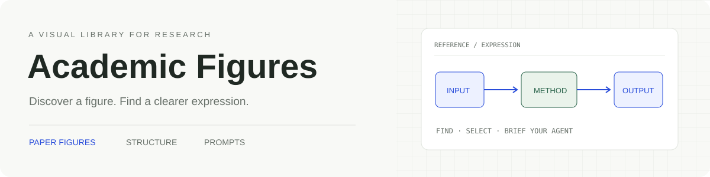

<div align="center">
  

  <h1>Awesome Academic Figures</h1>
  <p><strong>找到你的绘图灵感，交给你的绘图智能体。</strong></p>
  <p>为你的研究找到更精准优雅的表达</p>
  <p>
    <a href="https://doczbs.github.io/Awesome-Academic-Figures/">打开画廊 ↗</a> ·
    <a href="docs/USAGE.md">使用指南</a> ·
    <a href="docs/SEARCH_AND_TAGS.md">搜索与标签</a> ·
    <a href="CONTRIBUTING.md">参与贡献</a>
  </p>
</div>

---

一个面向研究者与绘图智能体的学术图形参考库。浏览真实论文中的 Teaser、机制图、方法框架与实验图，挑选表达方式，再将图片、结构描述、prompt 和自己的研究任务一起带走。

| 图形 | 论文 | 布局覆盖 | 来源 |
| :---: | :---: | :---: | :---: |
| **3,000** | **2,174** | **3,000 / 3,000** | 会议 · 期刊 · arXiv |

库存核对日期：**2026-10-01**。当前含 237 幅正式期刊图、21 幅带有已核实获奖标签的图；获奖标签是可选筛选条件。

## 从主题找到图

关键词支持缩写、中英文和常见写法。研究主题是多标签：同一张图可以关联多个主题，不必归入唯一分类。

| 想找什么 | 可以这样搜索 | 直接浏览 |
| --- | --- | --- |
| 强化学习 | `rl` / `reinforcement learning` / `强化学习` | [RL 图库](https://doczbs.github.io/Awesome-Academic-Figures/?q=rl) |
| 世界模型 | `world model` / `worldmodel` / `世界模型` | [World Model 图库](https://doczbs.github.io/Awesome-Academic-Figures/?q=world+model) |
| 上下文学习 | `icl` / `in-context learning` / `上下文学习` | [ICL 图库](https://doczbs.github.io/Awesome-Academic-Figures/?q=icl) |
| 世界动作模型 | `wam` / `world action model` / `世界动作模型` | [WAM 图库](https://doczbs.github.io/Awesome-Academic-Figures/?q=wam) |
| 同时涉及 RL 和世界模型 | 多选两个主题，或搜索 `rl world model` | [交集筛选](https://doczbs.github.io/Awesome-Academic-Figures/?topic=rl%2Cworld-model) |

研究主题多选采用**交集**。还能叠加图形类型、用途、布局、来源、年份与获奖标签。主题标签按论文标题、摘要和已有研究关键词识别，并记录依据；标签描述关联论文的主题，不保证每一张图都呈现该主题。WAM 当前没有明确元数据命中，会显示 0，后续有证据的收录可自动补入。

## 挑选 → 获得灵感 → 交给智能体

1. **找到表达方式**：按图形类型浏览，或用研究主题检索。上传自己的 PDF、TXT、Markdown，也可以粘贴摘要与方法找参考。
2. **选出想借鉴的部分**：选作参考，或先收藏；暂时隐藏的图可以恢复。
3. **带走参考包**：填写自己的绘图任务，下载图片、来源、结构描述与 prompt。智能体使用你的模块、关系和真实数据重新绘制。

论文匹配在浏览器内完成，文件和文字不上传到匹配服务。收藏留在当前浏览器；图片按需从 GitHub 加载。详见[使用指南](docs/USAGE.md)。

## 给智能体的入口

- [研究主题索引 JSON](https://doczbs.github.io/Awesome-Academic-Figures/research-tags.json)：稳定 tag ID、别名、图 ID、论文链接和匹配依据。
- [完整画廊目录 JSON](https://doczbs.github.io/Awesome-Academic-Figures/catalog.json)：分类、布局、来源、许可、文件地址与核验状态。
- [检索示例与字段说明](docs/SEARCH_AND_TAGS.md)：交集筛选、元数据证据和 Python 示例。

这些是可直接读取的静态索引。参考包的 `metadata.json` 也包含同一套主题标签与证据，方便智能体继续筛选和组织素材。

## 来源与核验

| 来源集合 | 图数 | 记录的核验层次 |
| --- | ---: | --- |
| 原始精选 | 18 | 具体版本、许可、原文件与完整图块 |
| Top-Conf Figure Gallery | 1,055 | 固定索引、来源与许可；部分图号待核 |
| SciFormaData-700K | 1,690 | 固定数据版本、行级许可与论文身份；准确图号待核 |
| 正式期刊 | 237 | 论文许可、JATS 图号、独立图文件与预览 |

Figure 1 **140 幅**、Figure 2 **130 幅**，其余 **2,730 幅图号待核**。图号与图类独立：Figure 1 不自动等于 Teaser。布局标签已全覆盖；完整结构与 prompt 核对为 **44 幅**，其余 prompt 保留草稿状态，未声称经过改绘生成验证。

代码与维护者原创文字采用 [MIT](LICENSE)。论文图像、作者原文件和引用图注遵循各自许可，具体依据随每张图保存。已发现的正文页、错误裁剪和第三方权利待核图会排除。请阅读[授权规则](docs/LICENSING.md)。

## 仓库导航

```text
├── src/           网页、搜索、论文匹配与参考包导出
├── figures/       已收录图文件；每图独立目录
├── data/          画廊目录、主题索引、来源与审核证据
├── docs/          使用、检索、设计与收录文档
│   ├── assets/    README 视觉资源
│   └── ingestion/ 远端收录与外部来源适配
├── scripts/       收录、索引构建、核验与站点维护工具
├── templates/     图元数据与智能体任务模板
├── requirements/  Python 收录依赖
└── .github/       云端收录与 Pages 发布流程
```

[文档索引](docs/README.md) · [数据说明](data/README.md) · [脚本索引](scripts/README.md) · [图文件规范](figures/README.md)

## 轻量本地开发

只检出前端和元数据，避免在本机拉取整套图库：

```sh
git clone --filter=blob:none --sparse https://github.com/DocZbs/Awesome-Academic-Figures.git
cd Awesome-Academic-Figures
git sparse-checkout set src scripts data docs public templates requirements .github
npm ci
npm run dev
```

图像仍按需从 GitHub 加载。`npm run build` 构建静态站点，并生成供智能体读取的主题索引。完整收录、原文件校验与发布在云端执行，见[收录流程](docs/ingestion/REMOTE_STAGING.md)。

欢迎提交有明确授权的论文图、分类修正、主题词和 prompt 改进。提交前请看[贡献指南](CONTRIBUTING.md)；如发现来源或权利问题，请通过 [GitHub Issues](https://github.com/DocZbs/Awesome-Academic-Figures/issues) 提供图 ID 与依据。
