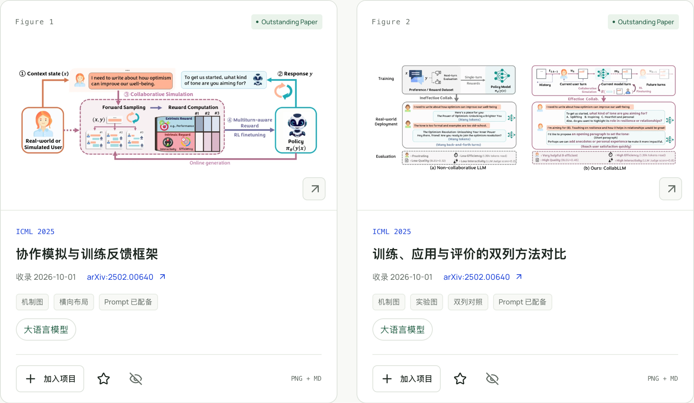
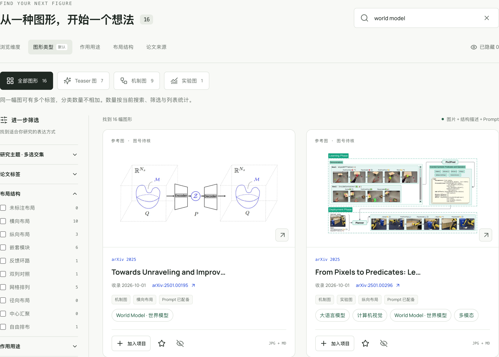
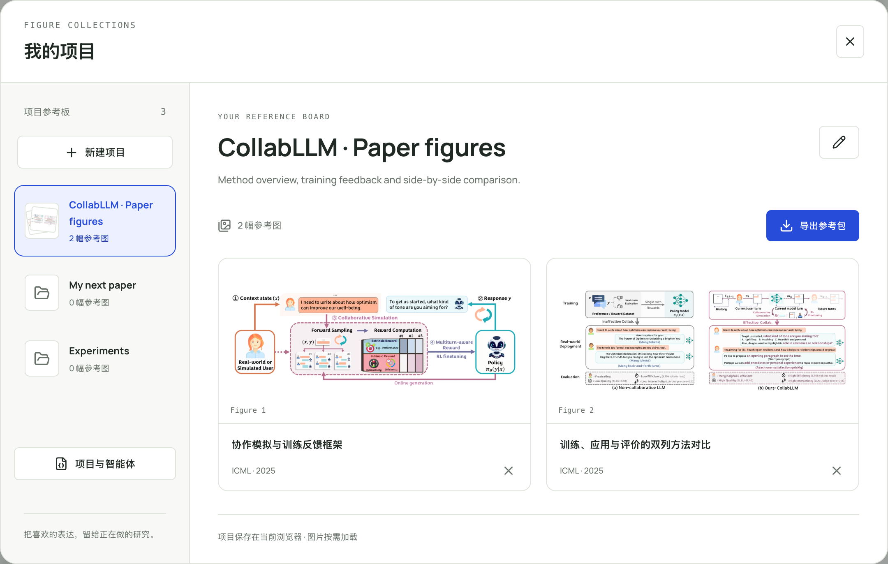

<div align="center">
  
  <h1>Awesome Academic Figures</h1>
  <p><strong>找到你的绘图灵感，交给你的绘图智能体。</strong></p>
  <p>为研究者与绘图智能体准备的学术图形参考库。</p>
  <p><a href="README.md">English</a> · <strong>简体中文</strong></p>
  <p>
    <a href="https://doczbs.github.io/Awesome-Academic-Figures/"><strong>打开画廊 ↗</strong></a> &nbsp; · &nbsp;
    <a href="AGENTS.md">交给智能体</a> &nbsp; · &nbsp;
    <a href="docs/USAGE.md">使用指南</a>
  </p>
  <p>
    <a href="docs/COLLECTION.md"></a>
    <a href="docs/COLLECTION.md"></a>
    <a href="LICENSE"></a>
  </p>
</div>

<a href="https://raw.githubusercontent.com/DocZbs/Awesome-Academic-Figures/main/docs/assets/figure-showcase.png">
  
</a>
<p align="center"><sub>源自真实论文，保留完整图形，带着来源一起看。点击预览可查看高清原图。</sub></p>

好研究，值得一张好图。这里收集会议、期刊与 arXiv 论文中的 Teaser、方法框架、机制与实验图。找到喜欢的表达，把图像、结构描述和 prompt 连同自己的研究任务一起交给绘图智能体，为你的研究找到更精准优雅的表达。

<h2 align="center">🎬 演示</h2>

<table align="center">
<tr><td width="720">

https://github.com/user-attachments/assets/d4c4fef6-f91e-4fa3-a247-5d7b5a0b3f8b

</td></tr>
</table>

## 🔎 找到适合你的表达

先选想画的图类，再沿着 [RL](https://doczbs.github.io/Awesome-Academic-Figures/?q=rl)、[World Model](https://doczbs.github.io/Awesome-Academic-Figures/?q=world+model) 或 [ICL](https://doczbs.github.io/Awesome-Academic-Figures/?q=icl) 逛。每张图可以带多个研究主题标签，让你顺着想法之间的联系找到参考。

<a href="https://raw.githubusercontent.com/DocZbs/Awesome-Academic-Figures/main/docs/assets/search-showcase.png">
  
</a>

已经有草稿？上传 PDF 或粘贴摘要与方法，选择想画的图类，让浏览器按关键词和研究主题推荐参考图。

## 📌 把灵感留在你的项目里

为一篇论文、一个研究方向建一块参考板。每张图都可以明确选择去向，也可以同时进入多个项目。慢慢整理自己的表达，再把选好的图和绘图任务一起导出。

<a href="https://raw.githubusercontent.com/DocZbs/Awesome-Academic-Figures/main/docs/assets/project-showcase.png">
  
</a>

## 🤖 给你的智能体一个入口

智能体可以通过 [CLI](scripts/agent.mjs) 检索同一份图库、查看来源、新建项目，以及添加或移除参考图。项目配置以轻量 JSON 文件往返：交给 Agent 挑选，带回画廊查看和调整。

> 阅读 [AGENTS.md](AGENTS.md)，为我的论文寻找 Teaser 和机制图参考，说明每张图适合借鉴什么，最后返回可导入画廊的 `aaf-projects.json`。

```sh
node scripts/agent.mjs search --query "rl world model" --type mechanism --limit 12
```

**[智能体指南 →](AGENTS.md)** &nbsp; [能力清单](https://doczbs.github.io/Awesome-Academic-Figures/agent.json) · [图库目录](https://doczbs.github.io/Awesome-Academic-Figures/catalog.json) · [项目格式](https://doczbs.github.io/Awesome-Academic-Figures/project-schema.json)

---

**现在就试试：** [打开画廊](https://doczbs.github.io/Awesome-Academic-Figures/) → 选一张图 → 加入你的项目 → 导出绘图参考包。直接在线使用即可。

网页支持中文和英文，可在顶部切换；图注、已有图形描述与 Prompt 保留来源语言。扩展使用文档为中文，智能体指南为英文。项目保存在各自浏览器或配置文件中，论文推荐在浏览器内按关键词与主题进行。截图为当前界面的 2× 无损 PNG，项目内容为示例。图号、来源和 prompt 的核验状态随每张图保留，详见[图库说明](docs/COLLECTION.md)。

**一起让好图更容易被找到。** 欢迎贡献有明确授权的论文图、主题标签与 prompt 改进。[贡献指南](CONTRIBUTING.md) · [本地开发](docs/DEVELOPMENT.md) · [反馈问题](https://github.com/DocZbs/Awesome-Academic-Figures/issues)

代码与维护者原创文字采用 [MIT](LICENSE)，论文图像遵循各自[许可](docs/LICENSING.md)。 [视频署名](docs/media/walkthrough-sources.md)。
